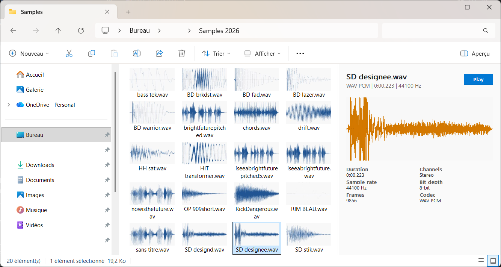

# AudioPreview for Explorer

[](LICENSE)

AudioPreview for Explorer is a native Windows Explorer extension for browsing audio samples faster.

It adds waveform thumbnails and a preview pane with playback, metadata, and a larger waveform, without opening a DAW or media player.



## Features

- Waveform thumbnails in Windows Explorer.
- Preview pane with file name, codec, duration, sample rate, bit depth, channels, and frame count.
- Play/stop button inside the preview pane.
- Optional Space key playback.
- Optional auto-play when a file is selected.
- Per-user installer. No administrator rights required.

## Current Status

This is an early Windows build focused on stable Explorer integration.

Current stable target:

- WAV / WAVE files
- PCM WAV metadata
- waveform thumbnails
- preview pane rendering
- basic audio playback

The codebase is being kept format-neutral so standard formats such as AIFF, FLAC, MP3, OGG/Opus, AAC/M4A, and CAF can be added later without renaming the product again.

## Install

1. Download the latest package from [Releases](https://github.com/kf4u43D/WavePreviewForExplorer/releases).
2. Extract the zip file.
3. Run `AudioPreviewInstallerGui.exe`.
4. Open Windows Explorer and enable the preview pane.

The installer writes only per-user registry entries under `HKCU` and installs files under:

```text
%LOCALAPPDATA%\AudioPreviewForExplorer
```

Command line install is also available:

```powershell
.\AudioPreviewInstaller.exe install --audio on --autoplay off --space-to-play on --restart-explorer
```

See [docs/installer.md](docs/installer.md) for all installer options.

## Build From Source

Requirements:

- Windows 10 or 11
- Visual Studio 2022 Build Tools with C++
- CMake
- vcpkg

Build and test:

```powershell
powershell -ExecutionPolicy Bypass -File scripts\bootstrap-dev.ps1
powershell -ExecutionPolicy Bypass -File scripts\full-build.ps1 -Configuration Release
```

Create an installer package:

```powershell
powershell -ExecutionPolicy Bypass -File scripts\package-installer.ps1 -Configuration Release
```

Development smoke test:

```powershell
powershell -ExecutionPolicy Bypass -File scripts\verify-cli-render.ps1
```

## Useful Links

- [Releases](https://github.com/kf4u43D/WavePreviewForExplorer/releases)
- [Issues](https://github.com/kf4u43D/WavePreviewForExplorer/issues)
- [Installer guide](docs/installer.md)
- [Architecture notes](docs/architecture.md)
- [Build workflow](.github/workflows/build.yml)

## Troubleshooting

If Explorer does not update immediately, restart Explorer or sign out and back in.

If a build cannot overwrite `AudioPreviewShellExtension.dll`, Explorer or `prevhost.exe` is still using it. Close Explorer windows or run:

```powershell
powershell -ExecutionPolicy Bypass -File scripts\rebuild-register-dev.ps1 -IncludePreviewHandler
```

If thumbnails do not appear, check that the file extension is registered and clear Explorer's thumbnail cache.

## License

AudioPreview for Explorer is released under the [MIT License](LICENSE).

Dependencies keep their own licenses.
